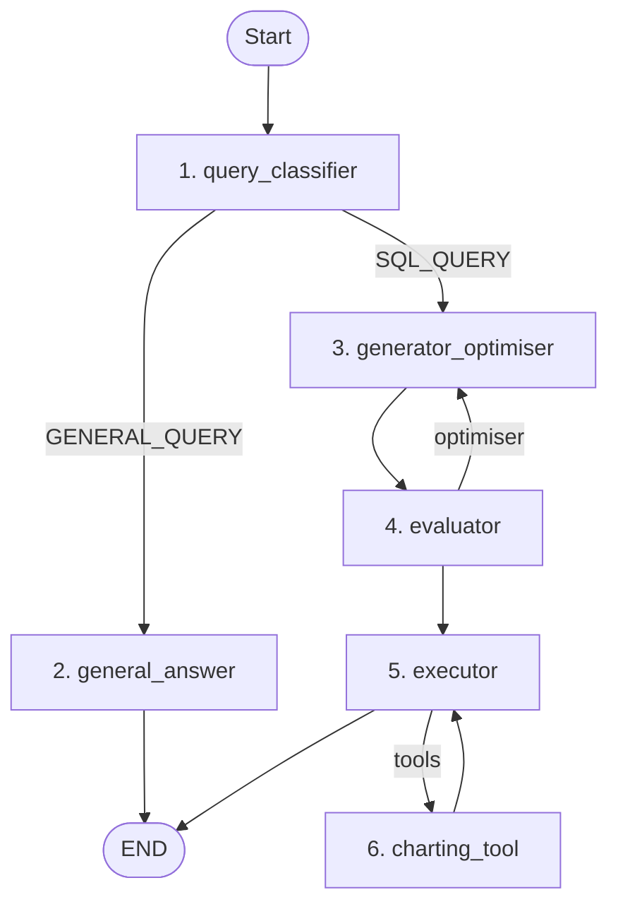

## Conversational Analytics with LangGraph and Gemini

A basic workflow built with **LangGraph**, **Python**, **BigQuery** and **Google Gemini**  to perform conversational analytics on Google Cloud BigQuery datasets. 

This repository shows the basics of building conversational analytics agents in Langgraph to interact with data stored on BigQuery with some guardrails. It uses a basic generate-evaluate-optimise pattern to generate SQL queries and answer user queries. It also demonstrates tool usage to generate basic charts from natural language questions.
By no means is this a production worthy agent. However it can serve as a baseline to build upon for production applications. 

---

## Workflow Graph

The workflow uses LangGraph's state structure to handle conversational routing, self-correction loops for SQL generation and dynamic tool-calling.

---

## Graph Node Descriptions

The state graph is comprised of six functional components, each acting as a distinct node:

### 1. `query_classifier`
* **Purpose:** Classifies the user's latest query as either a `SQL_QUERY` (database questions, schema inspections, reports) or a `GENERAL_QUERY` (off-topic, greetings etc).
* **Key Feature:** It also detects whether the user has requested a chart or visualisation (`has_chart_request: True/False`).

### 2. `general_answer`
* **Purpose:** Handles off-topic or general conversational queries.
* **Key Feature:** Politely redirects the user, explaining that the agent is specifically for conversational analytics on the loaded BigQuery dataset.

### 3. `generator_optimiser`
* **Purpose:** Generates a valid BigQuery SQL query based on the database schema and the user's prompt.
* **Key Feature:** Also operates as a correction node in the optimisation loop. If the `evaluator` detects syntax errors or logic issues, it uses the exact error message to rewrite and fix the query.

### 4. `evaluator`
* **Purpose:** Performs multi-layered safety and syntax checks on the generated SQL.
* **Key Features:**
  * **Application Safety Guard:** Scans the SQL using regular expressions to block non-read-only commands (`DELETE`, `DROP`, `UPDATE`, `INSERT`, `MERGE`, etc.) before any cloud execution is made.
  * **BigQuery Dry Run:** Submits the query using BigQuery's Dry Run compiler configuration to validate syntax and schema compliance without incurring cloud costs or executing any code.

### 5. `executor`
* **Purpose:** Executes the validated read-only SQL query against the BigQuery dataset.
* **Key Features:**
  * **Dynamic Tool Binding:** Binds `generate_chart_tool` to the model **only** if the classifier detected a chart request, ensuring consistent tool execution.
  * **Text Sanitization:** Automatically parses raw block-structured output (`[{'type': 'text', ...}]`) into a clean, reader-friendly conversational text response.

### 6. `charting_tool` (`ToolNode`)
* **Purpose:** A pre-built LangGraph `ToolNode` that executes the bound `generate_chart_tool` when requested by the executor.
* **Key Feature:** Automatically converts the BQ result payload into a Pandas DataFrame, dynamically determines the best plot type (only Line, Bar or Scatter supported) and embeds the Base64-encoded image directly into the final markdown response.
